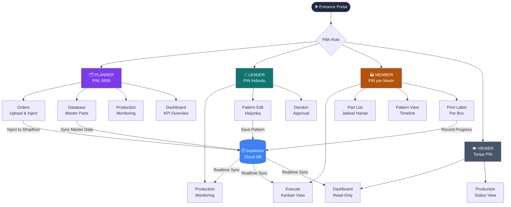
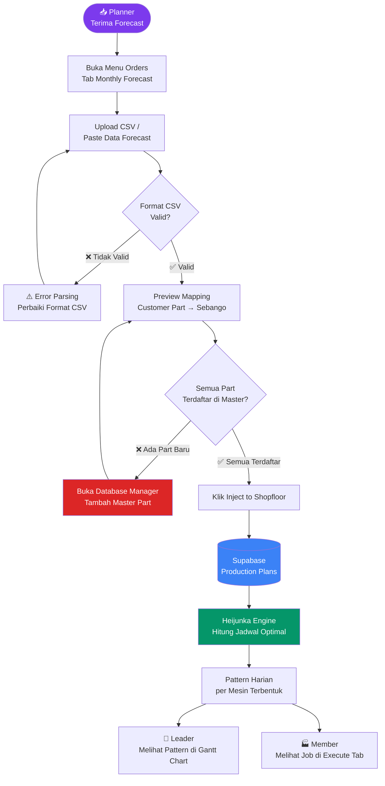
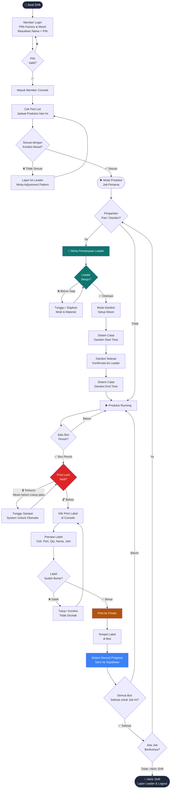
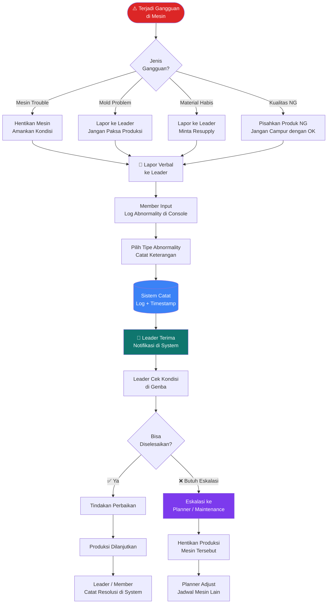
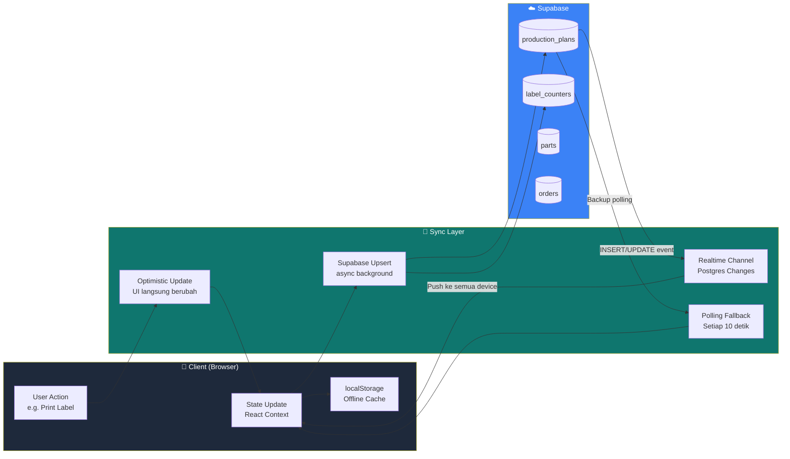
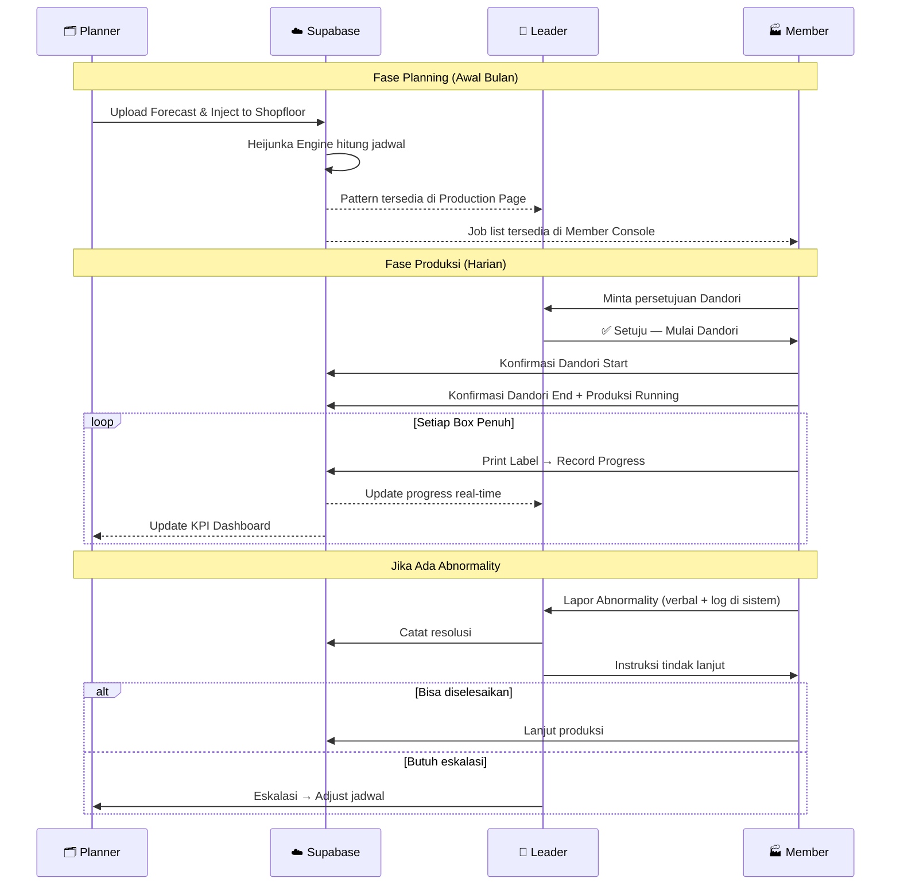

# System Flow — Integrated Production Planning System
### PT. Sugity Creatives

---

## 1. Overview — Alur Sistem & Role

---

## 2. Alur Order — Dari Forecast ke Shopfloor

---

## 3. Alur Eksekusi Produksi Harian (Per Mesin)

---

## 4. Alur Penanganan Abnormality

---

## 5. Alur Data Sync — Client ↔ Supabase

---

## 6. Ringkasan Interaksi Antar Role

---

*Flow diagram ini mencerminkan arsitektur dan alur kerja sistem **Integrated Production Planning System** PT. Sugity Creatives berdasarkan source code produksi terkini.*
